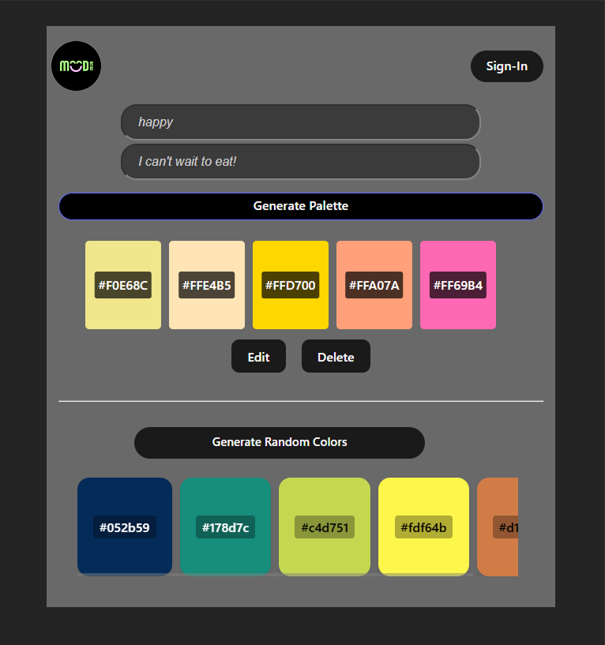

## Reflection on the Progress
F2/ and F3:
## Sources:
ColorMind: http://colormind.io/api-access/ 
React dev: https://react.dev/learn/react-developer-tools
Firebase/Firestore: https://firebase.google.com/docs/firestore
w3School: https://www.w3schools.com/react/react_jsx.asp
Youtube watched to learning about React: Sam Meech-Ward, Everything you need to know about React js.
Provide todo app: class example, and setup video.
When I started building the mood-based color palette generator in React, I thought it would be pretty simple—just use hooks and APIs. But I quickly hit a wall. Tailwind CSS wouldn’t initialize no matter how many times I reinstalled Node, npm, and NVM. I was frustrated, so I switched to plain CSS just so I could keep making progress. Then, when I tried to use OpenAI’s NLP for mood detection, I got stuck again because of API key issues. Instead of giving up, I created a manual keyword-matching system and used the Colormind API to generate palettes.

Working with useState and useEffect during this process wasn’t just about writing code—it was part of my learning journey. I used state to manage moods, inline editing, and saved palettes, and effects to fetch color palettes only when needed. It felt good to see how hooks could keep the UI responsive and efficient.
This project helped me develop several important web development skills. I became more comfortable structuring React components and thinking in terms of data flow. I learned how to debug more effectively using Vite’s development tools, and I gained confidence integrating third-party APIs into my frontend. I also sharpened my ability to write fallback logic—like using keyword matching when NLP didn’t work—which is a real-world skill that goes beyond textbook examples.
One of the biggest takeaways was the importance of iterative development. Starting with plain JavaScript before diving into JSX and full component abstraction helped me solidify my understanding of how React works under the hood. It also made it easier to isolate problems and test functionality step by step. If I were to do this project again, I’d spend more time planning my API architecture up front, and I’d probably set up environment variable management earlier to avoid key issues. I also realized I could have benefitted from component libraries or design systems to speed up the UI design process without getting bogged down by CSS bugs.
This experience also connected strongly with course concepts like state management, component-based design, and separation of concerns. I saw how theory translates into practical decisions—like when to lift state up, how to break down UI into reusable parts, and how to manage side effects responsibly. Even handling API failures became a way to practice graceful degradation and user experience design.

Overall, this project wasn’t just about building something functional—it was about learning to navigate the challenges of real-world development. It reminded me that building apps isn’t always linear, and that adapting to problems is part of what makes someone a strong developer. I'm walking away with more confidence, a deeper understanding of frontend architecture, and a more thoughtful approach to coding.

## Display in various screen size
Mobile - SE
    - Before search
    
    - After search
    

Ipad - Mini
    - Before search
    
    - After search
    

Laptop - Surface
    - Before search
    
    - After search
    

# React + Vite

This template provides a minimal setup to get React working in Vite with HMR and some ESLint rules.

Currently, two official plugins are available:

- [@vitejs/plugin-react](https://github.com/vitejs/vite-plugin-react/blob/main/packages/plugin-react) uses [Babel](https://babeljs.io/) for Fast Refresh
- [@vitejs/plugin-react-swc](https://github.com/vitejs/vite-plugin-react/blob/main/packages/plugin-react-swc) uses [SWC](https://swc.rs/) for Fast Refresh

## Expanding the ESLint configuration

If you are developing a production application, we recommend using TypeScript with type-aware lint rules enabled. Check out the [TS template](https://github.com/vitejs/vite/tree/main/packages/create-vite/template-react-ts) for information on how to integrate TypeScript and [`typescript-eslint`](https://typescript-eslint.io) in your project.
